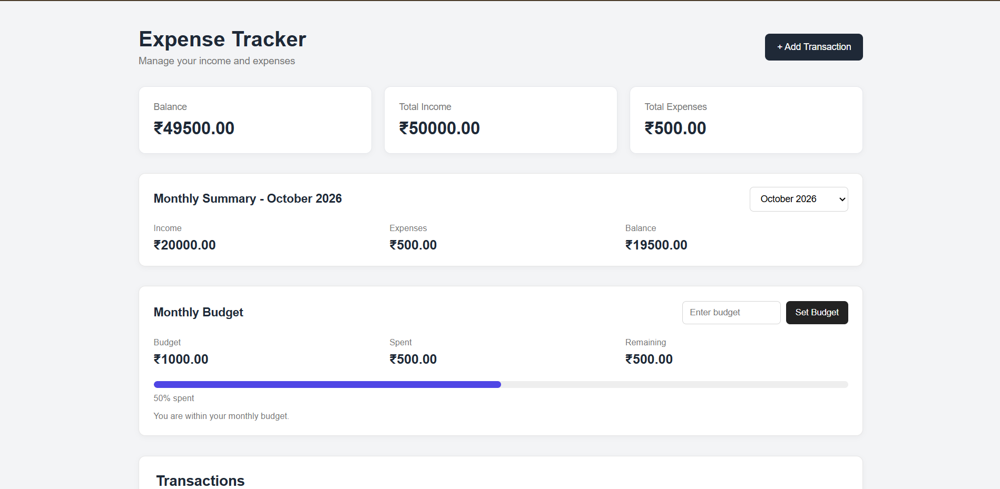
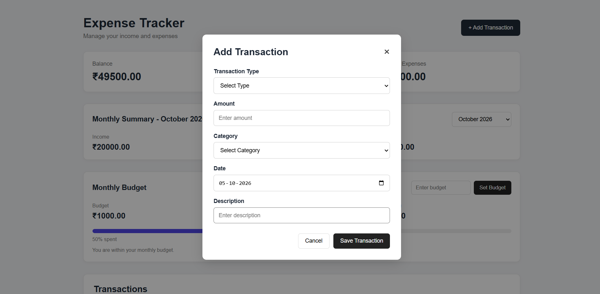
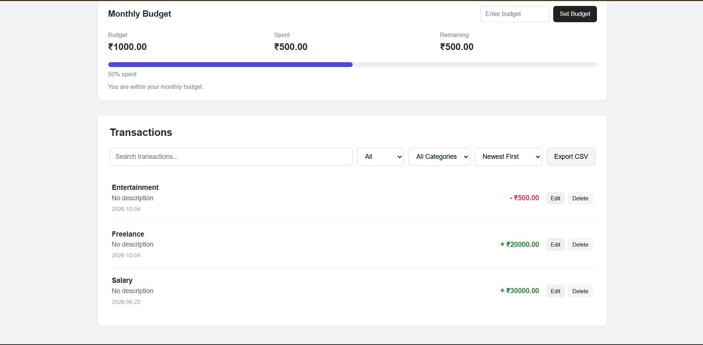
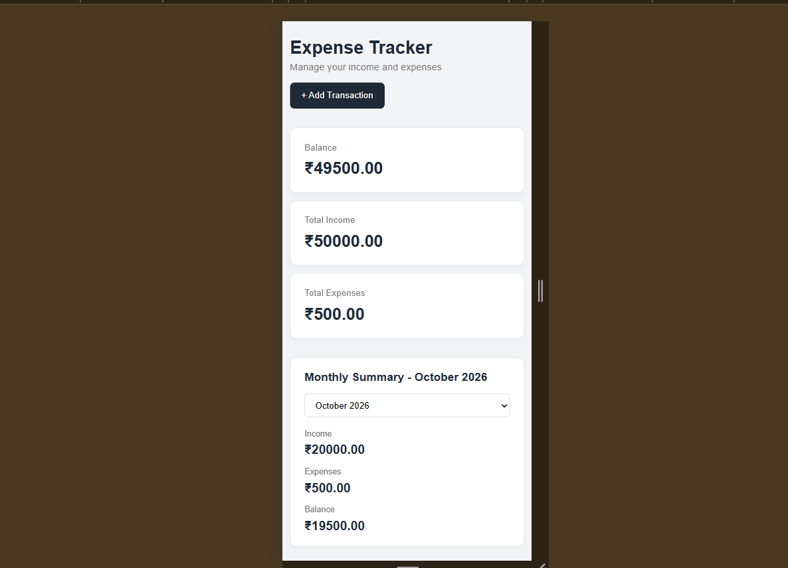

# Expense Tracker

A simple and responsive web-based Expense Tracker built using HTML, CSS, and JavaScript.

The application helps users manage their income and expenses, view financial summaries, set monthly budgets, and track their spending directly in the browser.

## Live Demo

[View Live Expense Tracker](https://godzi001.github.io/Expense-Tracker-Adwaith-K/)

## Screenshots

### Dashboard


### Add Transaction


### Transactions


### Mobile Responsive View


## Features

- Add income and expense transactions
- Edit existing transactions
- Delete transactions
- View total income, expenses, and balance
- Search transactions
- Filter transactions by type and category
- Sort transactions by date and amount
- View monthly income, expenses, and balance
- Set a monthly spending budget
- Track monthly spending using a progress bar
- Export transactions as a CSV file
- Validate transaction amounts
- Store transactions and budgets using Local Storage
- Responsive design for desktop and mobile devices

## Technologies Used

- HTML5
- CSS3
- JavaScript
- Browser Local Storage
- CSV Export using JavaScript

## How to Run

### Run Locally

1. Clone or download this repository.
2. Open the project folder.
3. Open `index.html` in a web browser.
4. The Expense Tracker will run directly in the browser.

No additional installation, dependencies, or server setup are required.

## Project Structure

```text
Expense-Tracker/
│
├── index.html
├── style.css
└── js/
    └── script.js